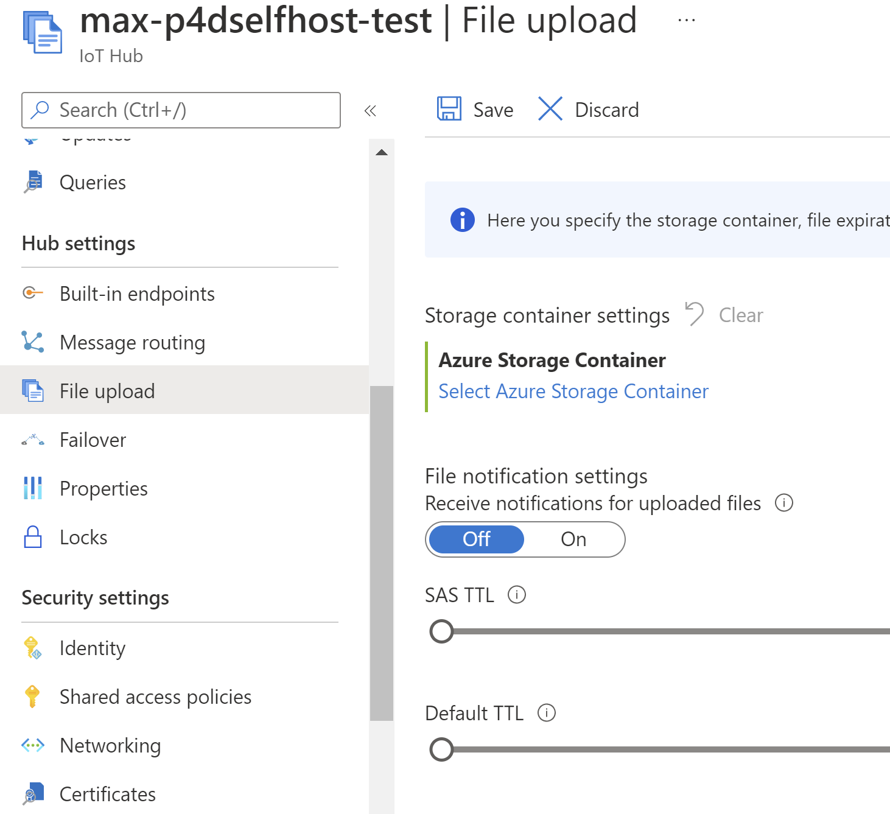
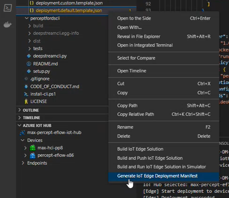

# Prerequisite checklist for Azure DeepStream Accelerator

This article provides you with a checklist of prerequisites and device configuration steps about how to set up your environment before you begin to create your first end-to-end Edge (artificial intelligence) AI solution with Azure DeepStream Accelerator. There are five key steps you must complete:

- Step 1. Software and model prerequisites
- Step 2. Install Azure Services
- Step 3. Set up the Edge device
- Step 4: Container deployment: Create a deployment manifest file
- Step 5: Deploy to your Edge device


## Step 1. Software and model prerequisites

Complete the following software and AI-model items to configure your environment:

- Clone the [repository](../README.md) to your local environment.
- Install the following:

  - [Visual Studio Code (VS Code)](https://code.visualstudio.com/) with the [IoT Hub Tools](https://marketplace.visualstudio.com/items?itemName=vsciot-vscode.azure-iot-tools) extension
  - [Python](https://www.python.org/downloads/)
  - [Node.js](https://nodejs.org/en/download/)

- An active Microsoft Azure subscription with required permissions.
- A RTSP stream player ([VideoLAN VLC media player or similar](https://www.videolan.org/vlc/)).
- A trained computer vision model. Depending on your model selection, you may also be required to supply a parser. For information about which parsers are available in this repository or from other sources, visit [Azure DeepStream Accelerator overview](../README.md).

## Step 2. Install Azure Services

You must deploy all of the following Azure Services:

-	[Azure Container Registry](https://azure.microsoft.com/en-us/services/container-registry/), where you will store your custom Docker containers.
-	[Azure IoT Hub](https://azure.microsoft.com/en-us/services/iot-hub/), which will manage the IoT Edge solution.
-	[Azure Storage](https://docs.microsoft.com/en-us/azure/storage/common/storage-account-overview), which will be used to store your videos.

### 1. Install the CLI tool

Install the CLI tool. For information, visit the [CLI Tool documentation](../cli/README.md).

### 2. Get your Blob Storage Account Key

Since you used the CLI Tool to install the Azure services, you’ll find an **Azure Storage Account** resource in your resource group in the Azure portal.

If you don’t know how to find your **Azure Storage Account**, follow the steps below. If you know where to find it, skip forward to the next step.

#### Find your Azure Storage Account

1. In the [Azure portal](https://ms.portal.azure.com/), go to your **Azure Storage Account**.
2. From the left navigation, select **Access Keys**.
3. Find **key1** and select **Show**.
4. Copy the value of **key1** and save it. You'll need it shortly.

   

#### Link your Blob Storage to your IoT Hub

1. Go to your IoT Hub in the Azure portal.
2. On the left navigation, under **Hub Settings**, locate **File Upload**.
3. Click **Select Azure Storage Container**.
4. Then select your **Blob Storage Account**.

   

## Step 3. Set up the Edge device

Azure DeepStream Accelerator is available on any device with sufficient storage space and an NVIDIA GPU, as long as it
supports NVIDIA's container runtime. However, most of our testing is done on Jetson Orin. Please be advised that we cannot
handle issues opened in regards to untested setups.

### Discrete NVIDIA GPU

If you would like to try the experience with a discrete NVIDIA GPU, it should work, but please be aware that
we do not test this configuration as heavily as the Orin setup, and we may not be able to help with issues
related to this setup.

- See here for an [overview on setting up Azure IoT Edge](https://learn.microsoft.com/en-us/azure/iot-edge/how-to-create-iot-edge-device?view=iotedge-1.4).
- See here for [a single Linux device setup](https://learn.microsoft.com/en-us/azure/iot-edge/how-to-provision-single-device-linux-symmetric?view=iotedge-1.4&tabs=azure-portal%2Cubuntu).

### NVIDIA Jetson AGX Orin

The NVIDIA Jetson AGX Orin Developer Kit allows you to develop full-featured AI applications for products based on Jetson devices.

- For information on how to provision your NVIDIA Jetson device to Azure and ensure that you have all the needed applications and libraries in your device, visit [Azure IoT Edge Configuration tool](https://github.com/Azure/iot-edge-config/tree/config_tool_v2).
-	For device-specific documentation, visit: [Getting Started with Jetson AGX Orin Developer Kit](https://developer.nvidia.com/embedded/learn/get-started-jetson-agx-orin-devkit).

## Step 4: Container deployment: Create a deployment manifest file

After you have deployed the basic Azure IoT environment, your next step is to deploy the Azure DeepStream Accelerator solution.

To deploy your Azure DeepStream Accelerator solution, you need the following five modules (Docker containers). These Docker containers work together to run the computer vision (CV) model, detect relevant business events, and upload relevant video to the cloud for future use.

- **AI Pipeline module**: Contains the DeepStream compatible CV model and communicates model inferences to the Business Logic module.
-	**Controller Module**: Enables management of the entire solution.
-	**Business Logic module**: Contains event detection logic, based on user defined Regions of Interest (ROIs). This is usually where you put your own business logic code (if applicable). It will determine if a pre-defined event occurs during a video segment and communicate this status to the Video Uploader.
-	**RTSP Simulation module**: Converts a stored video file into an RTSP stream to facilitate development. This is useful for debugging and development, as it allows you to use a video file instead of having to set up a camera for development. This container is optional in a deployment.
-	**Video Uploader module**: Processes video segments of pre-defined length. Uploads only those segments containing pre-defined events to blob storage, based on input from the Business Logic module.

These modules are deployed using a deployment manifest JSON file. The manifest file is created by populating the manifest template with environmental variables, contained in an .env file. The file may contain confidential information. Be careful that you don’t inadvertently share this information.

### Example of an .env file

Here is an [example](../ds-ai-pipeline/x86_64/template.env) of an ```.env``` file. Note that since it is an example, it may not accurately reflect the most recent version of the file.

   ```
     CONTAINER_REGISTRY_NAME=your-container-registry-url
          CONTAINER_REGISTRY_PASSWORD=your-container-registry-password
          CONTAINER_REGISTRY_USERNAME=your-container-registry-username
          BLOB_STORAGE_ACCOUNT_KEY=""
          APPLICATIONINSIGHTS_CONNECTION_STRING=""
          IOTHUB_DEVICE_CONNECTION_STRING=your-device-connection-string
          DS_AI_PIPELINE_IMAGE_URI=mcr.microsoft.com/azureedgedevices/azdaaipipeline:d923853-amd64
          BUSINESS_LOGIC_IMAGE_URI=mcr.microsoft.com/azureedgedevices/azdabusinesslogicmodule:d923853-amd64
   ```

> [!NOTE]
> If you’re using an x86 device, use [this manifest template](../ds-ai-pipeline/x86_64/deployment.default.template.json) and modify the values in [the template.env file](../ds-ai-pipeline/x86_64/template.env). <br>If you’re using an ARM device, use [this manifest template](../ds-ai-pipeline/arm/deployment.default.template.json) and modify the values in [the template.env file](../ds-ai-pipeline/arm/template.env).

### 1. Modify the .env file.

To set up your environment, you must make two changes to the ```.env``` file:

1. Replace the value of ```IOTHUB_DEVICE_CONNECTION_STRING``` with the value from the Azure portal.
2. Replace the value of ```BLOB_STORAGE_ACCOUNT_KEY``` with the value you saved in the Get your Blob Storage Account Key section, earlier in this article.

Leave the other environment variables in the file with a blank or null value for now. We’ll fill them later.

### 2. Create the manifest

-	In VS Code, right-click the deployment manifest template and select **Generate IoT Edge Deployment Manifest**.

  

This generates a JSON manifest file, which will be saved in a configuration folder in either **ds-ai-pipeline/arm** or **ds-ai-pipeline/x86_64**.

## Step 5: Deploy to your Edge device

Now that you have a JSON manifest file, the next step is to create a deployment to your device.

-	Your JSON manifest file is stored in a ```config``` folder in either ```ds-ai-pipeline/arm``` or ```ds-ai-pipeline/x86_64```. You can set this deployment to your device.

-	In VS Code, right click on the generated deployment manifest JSON file you created (NOT the template), select **Create deployment for single device**, and then select your IoT Edge device.

## Next steps

Now that you have completed setting-up your environment, you are ready to start creating your first end-to-end Edge AI solution leveraging Azure DeepStream Accelerator. We recommend the following tutorial to get started:

- [Getting started path](./tutorial-getstarted-path.md)
